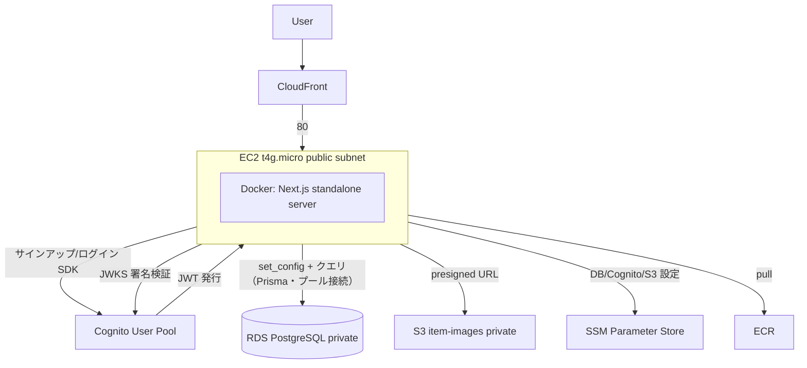
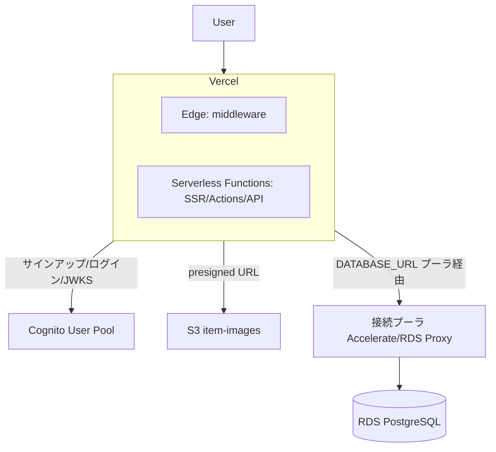

# mono-log インフラ設計書（AWS）

最終更新: 2026-06-13
対象アプリ: Next.js 15 (App Router) + React 19 + TypeScript / Server Actions + REST API(/api/v1)
構成方針: AWS ネイティブ（Cognito 認証 / RDS PostgreSQL / S3 / CloudFront）。アプリは Docker コンテナ化して EC2 で運用（同一イメージで ECS Fargate へ移行可能）。クエリ層は Prisma、DDL/RLS は Prisma Migrate の手書きSQLで管理。

---

## 1. アーキテクチャ概要

```
                 HTTPS                 HTTP(80)
  ブラウザ  ───────────▶  CloudFront  ─────────▶  EC2(Docker: Next.js)
                          (TLS/CDN)               │  port 3000→80
                                                  ├──▶ RDS PostgreSQL (private・RLS)
                                                  ├──▶ Cognito        (認証・JWT発行)
                                                  └──▶ S3             (商品画像・署名付きURL)

  設定/機密: SSM Parameter Store ──(EC2 の IAM ロールで取得)──▶ EC2 起動スクリプト
  イメージ:  ECR ──(EC2 が pull)──▶ Docker
```



| コンポーネント | 役割 | インスタンス/設定 |
| --- | --- | --- |
| CloudFront | HTTPS終端・CDN。視聴者にHTTPS強制、オリジン(EC2)へはHTTP | キャッシュ無効・全ヘッダ転送（動的アプリ） |
| EC2 | Docker で Next.js コンテナを1つ実行。SSHなし(SSM接続) | `t4g.micro`(ARM)・public subnet |
| RDS PostgreSQL | アプリDB。非公開。アプリは非所有者ロールで接続しRLS適用 | `db.t4g.micro`・Single-AZ・private |
| Cognito | サインアップ/ログイン/JWT発行/メール確認/PWリセット | User Pool + 公開クライアント |
| S3 | 商品画像を非公開保存。表示/保存は署名付きURL | 公開ブロック＋SSE |
| SSM Parameter Store | DB接続情報・パスワード・Cognito ID・バケット名 | String / SecureString |
| ECR | アプリのコンテナイメージ保管 | 直近10個保持 |

---

## 2. ネットワーク

```
VPC 10.0.0.0/16
├─ public  subnet a (10.0.0.0/24): EC2（自動パブリックIP）
├─ private subnet a (10.0.10.0/24): RDS (AZ-a)
└─ private subnet c (10.0.11.0/24): RDS 予備 (AZ-c, DBサブネットグループのマルチAZ要件)
   Internet Gateway: public のみ。private は外部経路を持たない
```

- **EC2 は public subnet**（Internet Gateway 経由で ECR/SSM/Cognito/S3 等の AWS API に到達）。NAT Gateway は使わない（常時課金を回避）。
- **RDS は private subnet**（インターネット非公開）。Security Group は VPC 内からの 5432 のみ許可。
- EC2 の Security Group は **CloudFront のマネージドプレフィックスリストからの 80 のみ許可**し、直接アクセスを遮断。
- IMDSv2 必須（`http_tokens = required`）。

### 接続の利点（EC2 常駐プロセス）
- Lambda 等のサーバーレスと違い**常駐プロセス**なので、RDS への接続を**プールして再利用**できる（同時実行ごとの接続枯渇が起きない。RDS Proxy 不要）。
- Next.js の standalone server（`node server.js`）を**そのまま起動**でき、変換アダプタが不要。

---

## 3. 認証（Amazon Cognito）

### フロー
1. サインアップ → Cognito がパスワードをハッシュ保管・確認メール送信。
2. ログイン → Cognito が **ID/アクセストークン(JWT) ＋ リフレッシュトークン**を発行。
3. アプリはトークンを httpOnly Cookie に保存（`setSession`）。
4. サーバ側は Cognito の **JWKS 公開鍵**で ID トークンを検証し `sub`/`email` を取得（`aws-jwt-verify`）。
5. middleware が ID トークンの失効を検知し、リフレッシュトークンで再発行（Edge で `fetch` 直叩き）。

### 担当範囲
| 機能 | 担当 |
| --- | --- |
| パスワードハッシュ化 / メール確認 / PWリセット / MFA / リフレッシュ回転 | **Cognito** |
| JWT 検証（JWKS） | アプリ |
| 認可（RLS） | アプリ + RDS |

---

## 4. 認可（RLS）設計

素の RDS には Supabase の「JWT → `auth.uid()` 自動連携」が無いため、認可をアプリ＋DBで再設計している。

1. アプリはDBに**非所有者ロール `monolog_app`** で接続する（所有者ではないため RLS が必ず適用される）。
2. 各DB操作を `withUser(sub, fn)` で包み、**トランザクション内で** `select set_config('app.current_user_id', sub, true)`（= SET LOCAL 相当）を実行してから処理する。
3. RLS ポリシーは `user_id = app.current_user_id()`（`current_setting` から sub を取り出す関数）。

→ DB レイヤで「自分の行だけ」を強制する多層防御（オブジェクトレベル認可）。`users.id = Cognito の sub`。DDL・RLS・ロール・seed は `prisma/migrations` の手書きSQLで管理し、`prisma migrate deploy`（本番は private RDS のため EC2 上の psql で同一SQLを適用）で反映する。クエリは Prisma Client（`schema.prisma` はイントロスペクションで生成したクエリ型）。

---

## 5. データ・設定の保管

| 種別 | 保管先 | 例 |
| --- | --- | --- |
| DB接続情報（非機密） | SSM `String` | `/mono-log/db/host`, `/db/port`, `/db/name`, `/db/username` |
| DBパスワード（機密） | SSM `SecureString` | `/mono-log/db/password`(master), `/db/app_password`(monolog_app) |
| Cognito ID（非機密） | SSM `String` | `/mono-log/cognito/user_pool_id`, `/cognito/client_id` |
| S3バケット名（非機密） | SSM `String` | `/mono-log/s3/bucket` |
| 商品画像 | S3（非公開） | `<userId>/<itemId>/<時刻>.<ext>` を署名付きURLで配布 |

- パスワードは Terraform の `random_password` で生成し SSM(`SecureString`)へ。コードに秘密を書かない。
- EC2 は IAM ロールで `/mono-log/*` の SSM 読取＋（SSM経由限定の）KMS 復号、S3 オブジェクト RW のみを最小権限で許可。

---

## 6. ホスティング（EC2 + Docker）と選定理由

| 観点 | **EC2 1台 + Docker（採用）** | Lambda (OpenNext) | ECS Fargate | App Runner |
| --- | --- | --- | --- | --- |
| 料金（小規模） | 約$6〜8/月（常時起動の最安） | ほぼ$0（スケールゼロ・ただし接続枯渇対策が必要） | 約$10/月〜 | 約$5/月〜 |
| RDS接続 | プール接続で安定 | 枯渇対策(Proxy等)が必要 | プール可 | プール可 |
| Next.js 互換 | `node server.js` 素直 | 変換アダプタに癖 | 素直 | 素直 |
| コールドスタート | なし | あり | なし | あり |
| 運用の手間 | 中（OS更新・監視） | 小 | 中 | 小 |

### 採用理由
1. **常駐プロセスで RDS 接続がプールできる**（サーバーレスの接続枯渇を回避）。
2. **standalone server をそのまま動かせる**（変換アダプタ不要）。
3. **同一 Docker イメージで ECS Fargate へ移行可能**＝拡張パスを保ったまま最小コスト。Fargate は EC2 より割高なため現時点では採用しない。

```
今（最小構成）                    将来（スケール時）
EC2 1台 (t4g.micro)  ──同一image──▶  ECS Fargate + ALB + Auto Scaling
Docker: node server.js
```

---

## 7. コスト試算（東京リージョン・小規模）

| 項目 | 月額目安（東京・小規模） |
| --- | --- |
| EC2 `t4g.micro` 1台 | 約 $6〜8 |
| RDS `db.t4g.micro` Single-AZ 20GB | 約 $13〜15 |
| CloudFront / Cognito / CloudWatch / SSM / ECR | $0〜数百円（使用量次第） |
| S3（画像 数GB） | 数十円 |
| Route 53（独自ドメイン使う場合のみ） | $0.50 |
| **合計** | **約 $20〜24/月**（EC2 + RDS が主因） |

> 起動中はこの額が課金される。コスト最小化は **最小インスタンス(`t4g.micro`)・Single-AZ・NAT回避・SSM(Secrets Manager不使用)・1台運用**という構成と、**使わないときは EC2/RDS/CloudFront を `terraform destroy -target=...` で停止**することで行う（VPC/Cognito/ECR/S3/SSM は残す）。可用性や運用自動化は次章の拡張で上げられる。

---

## 8. 本番グレードへの拡張余地

| 項目 | 最小構成 | 本番グレード |
| --- | --- | --- |
| コンピュート | EC2 1台 + Docker | **ECS Fargate**（同一イメージ）+ ローリング更新 |
| 可用性（アプリ） | EC2 1台 | **ALB + Auto Scaling Group**（マルチAZ・自動復旧） |
| DB 可用性 | Single-AZ | **Multi-AZ**（自動フェイルオーバー） |
| シークレット | SSM Parameter Store | **Secrets Manager**（自動ローテーション） |
| 監視 | CloudWatch 基本 | **X-Ray** 分散トレース + ダッシュボード |
| エッジ防御 | なし | **AWS WAF**（CloudFront 前段） |

> コンテナ化済みのため、コンピュートは **EC2 → Fargate** に差し替えるだけでスケール構成へ移行できる（イメージは共通）。

---

## 9. 代替案: Vercel 版

Next.js を最も手軽にホスティングするなら Vercel が選択肢になる。ただし「サーバーレス」と「private RDS」に起因する固有の対応が必要で、現 EC2 構成の利点（VPC内直結・常駐プール）を一部手放すことになる。**現状は採用しない**が、構成案として AWS(EC2)版との差分を含めて記録する。

### 9.1 構成図
```
                 HTTPS
  ブラウザ ───────────▶  Vercel
                         ├─ Edge: middleware（認可・トークン自動更新）
                         ├─ Serverless Functions:
                         │    Server Components / Server Actions / Route Handlers(/api/v1)
                         │
                         ├──▶ Cognito（変更なし・JWT発行/検証）
                         ├──▶ S3（変更なし・署名付きURL）
                         └──▶ 接続プーラ ──▶ RDS PostgreSQL
                              (Prisma Accelerate / RDS Proxy / PgBouncer)

  ※ CloudFront / EC2 / ECR / Docker / SSM は使わない。
     CDN/TLS は Vercel が内包、設定は Vercel の環境変数。
```



### 9.2 AWS(EC2)版との差分（レイヤー別・全項目）

| レイヤー | 現状（AWS / EC2・Docker） | Vercel 版 | 差分の要点 |
| --- | --- | --- | --- |
| ホスティング | EC2 1台で `node server.js`（常駐） | Vercel の Serverless Functions（リクエスト毎に起動） | 常駐 → サーバーレス |
| ビルド/パッケージ | Dockerfile(multi-stage) + `output:"standalone"` | Vercel がネイティブビルド | **Dockerfile/standalone/ECR/`docker buildx` は不要** |
| 配信・TLS | CloudFront（オリジン=EC2・HTTP） | Vercel が内包（エッジCDN+TLS） | **CloudFront 不要** |
| middleware | CloudFront 経由で Edge ランタイム | Vercel Edge ネイティブ | `fetch`ベースなので**コード変更なしで動く** |
| DBドライバ | Prisma（常駐プロセスから直結） | Prisma（プーラ経由） | クエリコードは同じ。接続経路が変わる |
| DB到達性 | 同一VPC内で private RDS に直結 | VPC外 → **RDS公開 or プロキシ公開** | ネットワーク設計の最大差分 |
| コネクション | 常駐プロセスでプール再利用 | リクエスト急増 → **外部プーラ必須** | Accelerate / RDS Proxy / PgBouncer(transaction) |
| 接続URL | `db/client.ts` が `DB_*` から組み立て | 同左（host をプーラに） | `DB_HOST`/`DATABASE_URL` をプーラのエンドポイントに |
| RLS（set_config） | `withUser`=`$transaction`+`set_config(...,true)` | 同左（**変更不要**） | transactionプーリングでも1TX単位で成立（9.4） |
| Prismaエンジン | Docker内 `prisma generate`(linux-musl-arm64) | Vercel build で `prisma generate`(`rhel-openssl-3.0.x`) | **binaryTargets を Vercel ランタイム向けに変更** |
| 認証（Cognito） | 変更なし | 変更なし | そのまま |
| 画像（S3）認証 | EC2の**IAMロール**で自動取得 | **IAMロール不可** → IAMユーザのアクセスキーを env に | Vercelは静的キーが必要（最小権限） |
| 設定/機密 | SSM Parameter Store（IAMロールで取得） | Vercel の環境変数 | **SSM 不要**。値は Vercel プロジェクト設定へ |
| DBマイグレーション | private RDS のため EC2+psql で適用 | RDS到達可なら `prisma migrate deploy` を直接実行 | CI から流せる |
| IaC（Terraform範囲） | VPC〜CloudFront を一括構築 | RDS+プーラ+Cognito+S3 のみ | **VPC/EC2/CloudFront/ECR が不要**で縮小 |
| CI/CD | build→ECR push→SSMで起動（手動寄り） | **git push で自動**＋ブランチごとプレビュー | 運用が大幅簡素化 |
| 監視 | CloudWatch | Vercel ログ/メトリクス（+ RDSはCloudWatch） | ログ基盤が分かれる |

### 9.3 必要になる対応（実装/設定）
1. **RDS到達性**: RDS を publicly accessible にし SG で送信元を絞る、または **RDS Proxy / プーラ**を VPC 前段に置きエンドポイントを公開。
2. **プーリング**: `DATABASE_URL` を **Prisma Accelerate** か **RDS Proxy / PgBouncer(transaction)** 経由に。Accelerate 利用時は `@prisma/extension-accelerate` を導入。
3. **S3認証**: EC2のIAMロールが無いため、**S3用IAMユーザのアクセスキー**を `AWS_ACCESS_KEY_ID`/`AWS_SECRET_ACCESS_KEY` として Vercel env に登録（S3オブジェクトRWのみの最小権限）。
4. **環境変数**: `DB_*`(hostはプーラ) / `AWS_REGION` / `COGNITO_USER_POOL_ID` / `COGNITO_CLIENT_ID` / `S3_IMAGE_BUCKET` ＋上記S3キーを Vercel に登録。SSLは `sslmode=require`。
5. **Prismaエンジン**: `schema.prisma` の `binaryTargets` に Vercel ランタイム向け(`rhel-openssl-3.0.x`/`native`)を設定。`prisma generate` は Vercel の build/`postinstall` で実行。
6. **不要化**: `Dockerfile` / `infra/compute.tf`(EC2) / `infra/cdn.tf`(CloudFront) / `infra/ecr.tf` / `migrate.ps1` / `deploy.ps1` は使わない（Terraform は RDS+プーラ+Cognito+S3 に縮小）。

### 9.4 RLS が serverless でも成立する理由
`withUser` は `prisma.$transaction(async tx => { await tx.$executeRaw\`select set_config('app.current_user_id', ${sub}, true)\`; ... })` の形で、**1トランザクション内で set_config(LOCAL) → クエリ**が完結する。transaction モードのプーラ（PgBouncer/RDS Proxy/Accelerate）は1トランザクションを1物理接続に固定するため、`SET LOCAL` 相当の設定がそのトランザクション内で保たれる。**コード変更は不要**。

### 9.5 デプロイ手順（Vercel 版）
1. Terraform で **RDS + プーラ + Cognito + S3** を作成（VPC/EC2/CloudFront/ECRは作らない）。
2. `prisma migrate deploy` でスキーマ適用（RDS到達可のため直接実行）＋`monolog_app` パスワード設定。
3. Vercel に GitHub リポジトリを連携し、**環境変数**（9.3）を登録。
4. `git push`（main）で自動ビルド・デプロイ。プレビュー環境はブランチごとに自動生成。

### 9.6 コスト（小規模）
| 項目 | 月額目安 |
| --- | --- |
| Vercel | Hobby $0（非商用）/ Pro $20〜 |
| RDS `db.t4g.micro` | 約 $13〜15 |
| 接続プーラ | Prisma Accelerate 無料枠〜 / RDS Proxy 約$11〜（vCPU課金） |
| S3 | 数十円 |

> CloudFront/EC2が無くなる一方、**プーラ費用と RDS 公開の運用**が増える。RDS Proxy は割高になりやすく、小規模では Prisma Accelerate（無料枠あり）が手軽。

### 9.7 トレードオフ（まとめ）
| 観点 | 現状（EC2/Docker） | Vercel |
| --- | --- | --- |
| デプロイ/CI | terraform + build/push（手動寄り） | git push で自動・プレビュー環境 |
| スケール | 手動（→Fargate） | 自動 |
| RDS到達性 | 同一VPCで private のまま | 公開 or プロキシが必要 |
| 接続 | 常駐プールで安定 | 外部プーラ必須 |
| シークレット | SSM＋IAMロール | Vercel env＋IAMユーザのキー |
| インフラ管理 | 自前（VPC/EC2/CloudFront） | RDS+プーラのみ |
| コスト | EC2+RDS 固定費 | Vercel + RDS + プーラ |

> まとめ: Vercel は運用が楽（自動デプロイ・自動スケール・CDN内包）だが、**private RDS の到達性・サーバーレスの接続プーリング・IAMロールの代替(静的キー)**を解く必要がある。VPC内で完結させ接続を常駐プールで安定させたい場合は現 EC2 構成が有利。

---

## 10. デプロイ手順の概要

IaC は **Terraform**（state は S3 バックエンド）。リソースは `terraform apply` で一括作成。詳細手順は[セットアップ手順書](setup-guide.md)を参照。

1. **`terraform apply`**: VPC / RDS / Cognito / S3 / ECR / EC2 / CloudFront / SSM / IAM を作成。
2. **DBマイグレーション**（`migrate.ps1`）: `prisma/migrations` のSQLを S3 経由で EC2 に渡し、psql で RDS に適用＋`monolog_app` パスワード設定（private RDS のため `prisma migrate deploy` を直接打てず、同一SQLを psql で流す）。
3. **ビルド & push**: `docker buildx build --platform linux/arm64 --provenance=false ... --push`（Docker内で `prisma generate`）。
4. **コンテナ起動**: SSM で EC2 の起動スクリプトを実行（SSMから設定取得して `docker run`）。
5. **動作確認** → 使い終わったら EC2/RDS/CloudFront を `terraform destroy -target=...` で削除し課金停止（VPC/Cognito/ECR/S3/SSM は残す）。

> 手動/CLI が残る部分: SSM へのシークレット投入は Terraform が `random_password` で自動化済み。RDS スキーマ適用は `migrate.ps1`。EC2 上の初回 `docker run` は SSM 経由。
